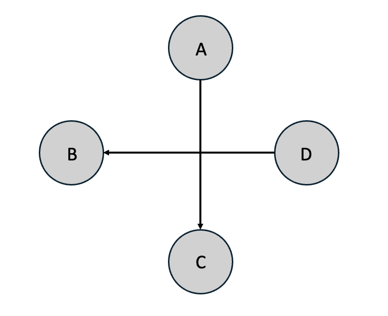
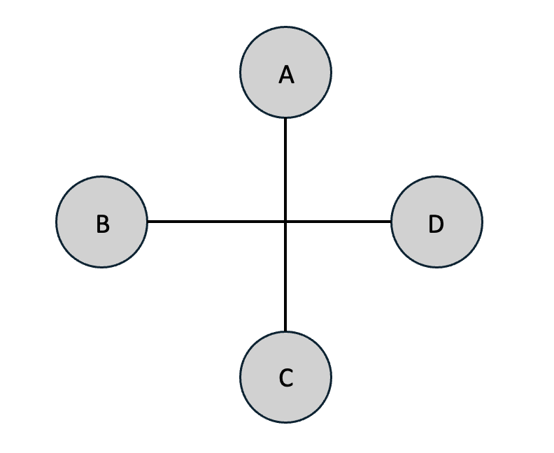
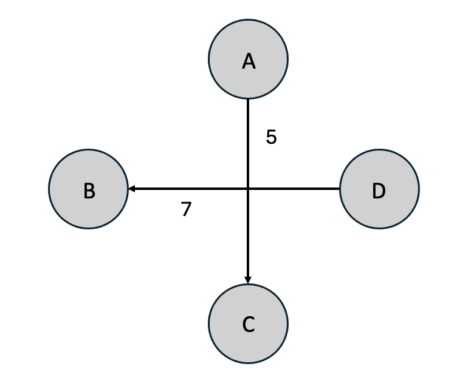
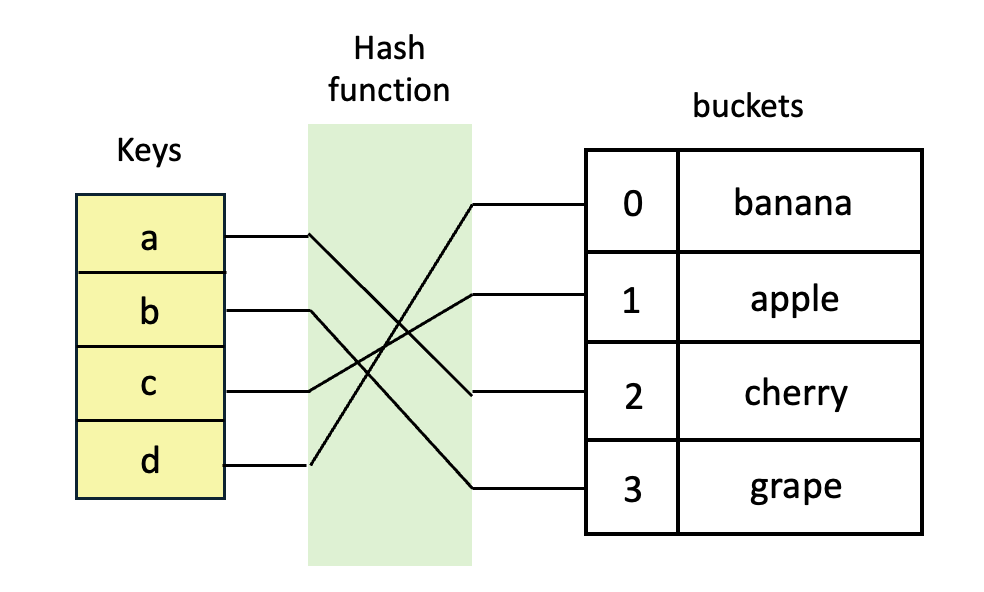

# Data Structure
## 리스트 (List)

### 배열 (Array)
- 정의: 동일한 타입의 데이터들을 저장하며, 고정된 크기를 가지고 있음.

- 특징: 인덱싱이 되어 있어 인덱스 번호로 데이터 접근 가능. 

#### 고정 크기 배열 (Fixed size Array)
- 정의: 생성 시 배열의 크기가 미리 지정되어 이후에 크기를 변경할 수 없음.

- 특징: 배열 크기가 고정되어 있어서 메모리 할당이 한 번만 이루어진다. 

- 장점: 인덱스를 사용해 특정 위치의 데이터에 빠르게 접근이 가능하다. 

- 단점: 크기를 미리 결정해야하며, 중간에 요소를 삽입하거나 삭제하려면 O(n)의 시간이 소요된다. 

- 예시
```c
int arr[5] = {1, 2, 3, 4, 5}; // 크기 5의 배열 생성
```

#### 동적 배열
- 정의: 배열의 크기가 가변적이며, 런타임 동안 크기를 동적으로 변경할 수 있는 배열.

- 특징: 프로그램 실행 중에 메모리가 동적으로 할당되고 해제된다. 

- 장점: 추가 데이터를 수용할 수 있도록 크기를 동적으로 확장하므로 유연성을 지닌다. 

- 단점: 메모리 할당 및 해제 과정에서 추가적인 시간이 필요하다. 

- 예시
```c
int* arr = (int*)malloc(5 * sizeod(int)); // 크기 5의 동적 배열 생성
```
```Java 
ArrayList<Integer> arr = new ArrayList<>(); 
```
``` Python
arr = [] # 빈 리스트 생성
```

### 연결리스트 (Linked List)
- 정의: 각 데이터 시퀀스가 순서를 가지고 연결된 순차적 구조의 배열.

- 특징: 동적인 데이터 삭제/ 추가에 유리하며, 각 노드가 다음이나 이전 노드와의 연결을 담당하는 포인터와 데이터를 가지고 한 줄로 연결되어 있는 방식으로 데이터를 저장. 

#### 1. 단일 연결 리스트 (Singly Linked List)
- 정의: 각 노드가 하나의 다음 노드를 가리키는 포인터를 가지는 연결 리스트.

- 특징: 마지막 노드는 NULL 포인터를 가진다.

- 장점: 동적으로 크기 조정이 가능하다.

- 단점: 역방향 탐색이 불가능하여 특정 요소를 찾으려면 순차적으로 탐색해야 함.
```c
struct Node {
    int data;
    struct Node* next;
};

struct Node* createNode(int data) {
    struct Node* newNode = (struct Node*)malloc(sizeof(struct Node));
    newNode->data = data;
    newNode->next = NULL;
    return newNode;
}
```
#### 2. 이중 연결 리스트 (Doubly Linked List)
- 정의: 각 노드가 이전 노드와 다음 노드를 가리키는 두 개의 포인터를 가지는 연결 리스트.

- 장점: 양방향 탐색이 가능하다. 특정 위치에서 삽입/ 삭제가 더 효율적이다.

- 단점: 추가적인 포인터로 인해 메모리 사용량이 증가. 
```c
struct Node {
    int data;
    struct Node* next;
    struct Node* prev;
};

struct Node* createNode(int data) {
    struct Node* newNode = (struct Node*)malloc(sizeof(struct Node));
    newNode->data = data;
    newNode->next = newNode->prev = NULL;
    return newNode;
}
```
#### 3. 원형 연결 리스트 (Circular Linked List)
- 정의: 마지막 노드가 NULL 대신 첫 번째 노드를 가리키는 연결 리스트.

- 장점: 모든 노드가 시작점이 될 수 있다. 

- 단점: 개별 노드에 대한 직접적인 접근은 제공되지 않으며, 무한 루프에 빠질 위험이 존재.
```c
struct Node {
    int data;
    struct Node* next;
};

struct Node* createNode(int data) {
    struct Node* newNode = (struct Node*)malloc(sizeof(struct Node));
    newNode->data = data;
    newNode->next = newNode; // 자기 자신을 가리킴
    return newNode;
}
```
 #### 4. 다중 연결 리스트 ( Multilevel Linked List)
 - 정의: 각 노드가 다수의 포인터를 가지는 연결 리스트.

- 특징: 각 노드가 다음 노드뿐만 아니라 하위 리스트를 가리킬 수 있다.

- 장점: 계층적 데이터를 표현하는데 적합.

- 단점: 각 노드가 추가적인 포인터를 가지므로 메모리 사용량이 증가. 
```c
struct Node {
    int data;
    struct Node* next;
    struct Node* down; // 다른 리스트를 가리킬 포인터
};

struct Node* createNode(int data) {
    struct Node* newNode = (struct Node*)malloc(sizeof(struct Node));
    newNode->data = data;
    newNode->next = newNode->down = NULL;
    return newNode;
}
```
## 스택 (Stack)
- 정의: LIFO(Last In, First Out) 구조를 가지는 자료구조. 즉, 마지막에 삽입된 데이터가 가장 먼저 삭제된다.

- 특징: Push(데이터 삽입), Pop(데이터 제거), Peek(데이터 조회) 등의 연산을 배열의 Top(끝)에서 수행.

#### 1. 배열 기반 스택 (Array-based Stack)
- 정의: 스택을 배열로 구현한 형태.

- 특징: 고정된 크기를 가지며, 메모리 공간이 제한적이다.

- 장점: 메모리 접근 속도가 빠르다. 구현이 비교적 간단함.

- 단점: 크기를 동적으로 조정하려면 추가적인 작업이 필요하며, 이로 인해 시간과 메모리가 소모됨. 
```c
struct Stack {
    int* arr;
    int top;
    int capacity;
};

// 스택 생성 함수
struct Stack* createStack(int capacity) {
    struct Stack* stack = (struct Stack*)malloc(sizeof(struct Stack));
    stack->capacity = capacity;
    stack->top = -1;
    stack->arr = (int*)malloc(capacity * sizeof(int));
    return stack;
}

// 스택이 비었는지 확인하는 함수
int isEmpty(struct Stack* stack) {
    return stack->top == -1;
}

// 스택이 가득 찼는지 확인하는 함수
int isFull(struct Stack* stack) {
    return stack->top == stack->capacity - 1;
}

// 스택에 요소 추가하는 함수 (push)
void push(struct Stack* stack, int value) {
    if (isFull(stack)) {
        printf("Stack overflow\n");
        return;
    }
    stack->arr[++stack->top] = value;
}

// 스택에서 요소 제거하는 함수 (pop)
int pop(struct Stack* stack) {
    if (isEmpty(stack)) {
        printf("Stack underflow\n");
        return -1; // 에러 값 반환
    }
    return stack->arr[stack->top--];
}

// 스택의 최상단 요소 확인하는 함수 (peek)
int peek(struct Stack* stack) {
    if (isEmpty(stack)) {
        printf("Stack is empty\n");
        return -1; // 에러 값 반환
    }
    return stack->arr[stack->top];
}

```
#### 2. 연결 리스트 기반 스택 (Linked List-based Stack)
- 정의: 스택을 연결 리스트로 구현한 형태.

- 특징: 배열과 달리, 스택의 각 요소를 노드 형태로 저장하며, 각 노드는 데이터와 다음 노드를 가리키는 포인터를 가진다. 

- 장점: 메모리의 크기가 동적으로 조정되므로, 초기 크기를 지정할 필요 없음. 메모리 낭비 적음.

- 단점: 각 노드가 포인터를 사용하여 다음 노드를 가리키므로, 포인터 관리가 필요하다. 
```c
struct Node {
    int data;
    struct Node* next;
};

struct Stack {
    struct Node* top;
};

// 스택 생성 함수
struct Stack* createStack() {
    struct Stack* stack = (struct Stack*)malloc(sizeof(struct Stack));
    stack->top = NULL;
    return stack;
}

// 스택이 비었는지 확인하는 함수
int isEmpty(struct Stack* stack) {
    return stack->top == NULL;
}

// 스택에 요소 추가하는 함수 (push)
void push(struct Stack* stack, int value) {
    struct Node* newNode = (struct Node*)malloc(sizeof(struct Node));
    newNode->data = value;
    newNode->next = stack->top;
    stack->top = newNode;
}

// 스택에서 요소 제거하는 함수 (pop)
int pop(struct Stack* stack) {
    if (isEmpty(stack)) {
        printf("Stack underflow\n");
        return -1; // 에러 값 반환
    }
    int value = stack->top->data;
    struct Node* temp = stack->top;
    stack->top = stack->top->next;
    free(temp);
    return value;
}

// 스택의 최상단 요소 확인하는 함수 (peek)
int peek(struct Stack* stack) {
    if (isEmpty(stack)) {
        printf("Stack is empty\n");
        return -1; // 에러 값 반환
    }
    return stack->top->data;
}

```
#### 3. 최소값/최대값 추적 스택 (Min/Max Stack)
- 정의: 스택에 데이터를 삽입하면서 동시에 스택에 저장된 최소값과 최대값을 추적할 수 있는 자료구조.
- 특징: 삽입과 삭제가 모두 O(1) 시간 내에 이루어지므로, 최소값과 최대값 추적에 있어 효율적이다.
- 장점: 별도의 반복문을 사용할 필요 없이 최소값과 최대값을 찾을 수 있다.
- 단점: 두 개의 스택을 사용하거나 하나의 스택에 최소값과 최대값을 저장하는 방식이기 때문에 공간 복잡도가 증가한다. 
```c
struct Stack {
    int* arr;
    int top;
    int capacity;
};

struct MinMaxStack {
    struct Stack* mainStack;
    struct Stack* minStack;
    struct Stack* maxStack;
};

// 스택 생성 함수
struct Stack* createStack(int capacity) {
    struct Stack* stack = (struct Stack*)malloc(sizeof(struct Stack));
    stack->capacity = capacity;
    stack->top = -1;
    stack->arr = (int*)malloc(capacity * sizeof(int));
    return stack;
}

// 스택에 요소 추가하는 함수 (push)
void push(struct MinMaxStack* stack, int value) {
    // mainStack에 값 추가
    push(stack->mainStack, value);

    // minStack에 최소값 추가
    if (isEmpty(stack->minStack) || value <= peek(stack->minStack)) {
        push(stack->minStack, value);
    }

    // maxStack에 최대값 추가
    if (isEmpty(stack->maxStack) || value >= peek(stack->maxStack)) {
        push(stack->maxStack, value);
    }
}

// 스택에서 요소 제거하는 함수 (pop)
int pop(struct MinMaxStack* stack) {
    if (isEmpty(stack->mainStack)) {
        printf("Stack underflow\n");
        return -1; // 에러 값 반환
    }

    int value = pop(stack->mainStack);

    // minStack에서 최소값 제거
    if (value == peek(stack->minStack)) {
        pop(stack->minStack);
    }

    // maxStack에서 최대값 제거
    if (value == peek(stack->maxStack)) {
        pop(stack->maxStack);
    }

    return value;
}

// 스택의 최상단 요소 확인하는 함수 (peek)
int peek(struct MinMaxStack* stack) {
    if (isEmpty(stack->mainStack)) {
        printf("Stack is empty\n");
        return -1; // 에러 값 반환
    }
    return peek(stack->mainStack);
}

// 현재 최소값 확인 함수
int getMin(struct MinMaxStack* stack) {
    if (isEmpty(stack->minStack)) {
        printf("Stack is empty\n");
        return -1; // 에러 값 반환
    }
    return peek(stack->minStack);
}

// 현재 최대값 확인 함수
int getMax(struct MinMaxStack* stack) {
    if (isEmpty(stack->maxStack)) {
        printf("Stack is empty\n");
        return -1; // 에러 값 반환
    }
    return peek(stack->maxStack);
}

```
## 큐 (Queue)
- 정의: 선입선출 (Firs In, First Out, FIFO) 방식으로 데이터를 처리하는 자료구조.

- 특징
  
  (1) 선입선출: 가장 먼저 들어간 데이터가 가장 먼저 나가는 방식으로 동작.
  
  (2) 두 가지 끝 (Front, Rear): front--큐의 앞쪽, 삭제 (dequeue) 연산이 일어나는 곳. rear--큐의 뒤쪽, 삽입 (enqueue) 연산이 일어나는 곳. 

  (3) 동적 크기: 큐의 크기는 고정되지 않으며 데이터를 삽입할 때마다 크기가 동적으로 확장될 수 있음.
   
### 1. 배열 기반 큐 (Array-based Queue)
- 정의: 배열을 사용하여 큐를 구현한 자료구조. 삽입과 삭제 연산을 배열의 두 끝인 front 와 rear 을 기준으로 처리함. 

- 특징: 큐의 크기는 고정되어 있으며, 배열 기반 큐에서 삽입과 삭제는 각각 O(1) 시간 복잡도로 수행된다.

- 장점: 배열의 인덱스를 이용하여 큐의 데이터를 빠르게 접근할 수 있음.

- 단점: 뒤에서만 데이터를 삽입할 수 있는 큐의 front에서 데이터를 삭제하면서 배열의 앞부분에 빈 공간이 남게 되면 메모리 낭비가 초래될 수 있다.
```c
struct Queue {
    int* arr;
    int front;
    int rear;
    int capacity;
};

// 큐 생성 함수
struct Queue* createQueue(int capacity) {
    struct Queue* queue = (struct Queue*)malloc(sizeof(struct Queue));
    queue->capacity = capacity;
    queue->front = -1;
    queue->rear = -1;
    queue->arr = (int*)malloc(capacity * sizeof(int));
    return queue;
}

// 큐가 비었는지 확인하는 함수
int isEmpty(struct Queue* queue) {
    return queue->front == -1;
}

// 큐가 가득 찼는지 확인하는 함수
int isFull(struct Queue* queue) {
    return queue->rear == queue->capacity - 1;
}

// 큐에 요소 추가하는 함수 (enqueue)
void enqueue(struct Queue* queue, int value) {
    if (isFull(queue)) {
        printf("Queue overflow\n");
        return;
    }
    if (queue->front == -1) {
        queue->front = 0;
    }
    queue->arr[++queue->rear] = value;
}

// 큐에서 요소 제거하는 함수 (dequeue)
int dequeue(struct Queue* queue) {
    if (isEmpty(queue)) {
        printf("Queue underflow\n");
        return -1; // 에러 값 반환
    }
    int value = queue->arr[queue->front];
    if (queue->front == queue->rear) { // 큐가 비었을 경우
        queue->front = queue->rear = -1;
    } else {
        queue->front++;
    }
    return value;
}

// 큐의 첫 번째 요소 확인하는 함수 (front)
int front(struct Queue* queue) {
    if (isEmpty(queue)) {
        printf("Queue is empty\n");
        return -1; // 에러 값 반환
    }
    return queue->arr[queue->front];
}
```
### 2. 연결 리스트 기반 큐 (Linked List-based Queue)
- 정의: 큐의 요소들이 연결 리스트의 노드로 저장되는 자료구조. 

- 특징: 큐의 크기가 고정되지 않기 때문에 자유롭게 데이터를 삽입할 때는 tail에서 삽입하고, 데이터를 삭제할 때는 head에서 삭제할 수 있다. 

- 장점: 연결 리스트 기반 큐는 필요한 만큼만 메모리를 할당하므로 메모리 낭비를 줄일 수 있다. 

- 단점: 포인터를 저장해야 하므로, 배열 기반 큐보다 더 많은 메모리를 사용한다. 
```c
struct Node {
    int data;
    struct Node* next;
};

struct Queue {
    struct Node* front;
    struct Node* rear;
};

// 큐 생성 함수
struct Queue* createQueue() {
    struct Queue* queue = (struct Queue*)malloc(sizeof(struct Queue));
    queue->front = queue->rear = NULL;
    return queue;
}

// 큐가 비었는지 확인하는 함수
int isEmpty(struct Queue* queue) {
    return queue->front == NULL;
}

// 큐에 요소 추가하는 함수 (enqueue)
void enqueue(struct Queue* queue, int value) {
    struct Node* newNode = (struct Node*)malloc(sizeof(struct Node));
    newNode->data = value;
    newNode->next = NULL;

    if (queue->rear == NULL) {
        queue->front = queue->rear = newNode;
        return;
    }
    queue->rear->next = newNode;
    queue->rear = newNode;
}

// 큐에서 요소 제거하는 함수 (dequeue)
int dequeue(struct Queue* queue) {
    if (isEmpty(queue)) {
        printf("Queue underflow\n");
        return -1; // 에러 값 반환
    }

    struct Node* temp = queue->front;
    int value = temp->data;
    queue->front = queue->front->next;

    if (queue->front == NULL) { // 큐가 비었을 경우
        queue->rear = NULL;
    }
    free(temp);
    return value;
}

// 큐의 첫 번째 요소 확인하는 함수 (front)
int front(struct Queue* queue) {
    if (isEmpty(queue)) {
        printf("Queue is empty\n");
        return -1; // 에러 값 반환
    }
    return queue->front->data;
}
```
### 3. 순환 큐 (Circular Queue)
- 정의: 배열을 원형으로 연결한 형태. front와 rear이 배열의 끝에 도달하면 다시 처음으로 돌아가서 데이터를 삽입하고 삭제할 수 있음.

- 특징: 큐의 크기가 고정되어 있지만, 배열이 꽉 차더라도 배열의 앞 부분이 비면 그 공간을 재사용할 수 있음.

- 장점: 큐의 앞부분에 빈 공간이 생기면 재사용이 가능하므로 메모리 낭비를 최소화.

- 단점: 큐의 크기를 동적으로 확장할 수 없음. 

```c
struct Queue {
    int* arr;
    int front;
    int rear;
    int capacity;
};

// 큐 생성 함수
struct Queue* createQueue(int capacity) {
    struct Queue* queue = (struct Queue*)malloc(sizeof(struct Queue));
    queue->capacity = capacity;
    queue->front = queue->rear = -1;
    queue->arr = (int*)malloc(capacity * sizeof(int));
    return queue;
}

// 큐가 비었는지 확인하는 함수
int isEmpty(struct Queue* queue) {
    return queue->front == -1;
}

// 큐가 가득 찼는지 확인하는 함수
int isFull(struct Queue* queue) {
    return (queue->rear + 1) % queue->capacity == queue->front;
}

// 큐에 요소 추가하는 함수 (enqueue)
void enqueue(struct Queue* queue, int value) {
    if (isFull(queue)) {
        printf("Queue overflow\n");
        return;
    }

    if (isEmpty(queue)) {
        queue->front = queue->rear = 0;
    } else {
        queue->rear = (queue->rear + 1) % queue->capacity;
    }
    queue->arr[queue->rear] = value;
}

// 큐에서 요소 제거하는 함수 (dequeue)
int dequeue(struct Queue* queue) {
    if (isEmpty(queue)) {
        printf("Queue underflow\n");
        return -1; // 에러 값 반환
    }

    int value = queue->arr[queue->front];
    if (queue->front == queue->rear) { // 큐가 비었을 경우
        queue->front = queue->rear = -1;
    } else {
        queue->front = (queue->front + 1) % queue->capacity;
    }
    return value;
}

// 큐의 첫 번째 요소 확인하는 함수 (front)
int front(struct Queue* queue) {
    if (isEmpty(queue)) {
        printf("Queue is empty\n");
        return -1; // 에러 값 반환
    }
    return queue->arr[queue->front];
}
```
### 4. 우선순위 큐 (Priority Queue)
- 정의: 큐에 저장된 요소들이 우선순위에 따라 처리되는 자료구조. 각 요소는 우선순위를 가지고 있음. 

#### (1) 배열 기반 우선순위 큐 
- 정의: 큐의 요소들이 우선순위에 따라 정렬된 배열을 사용하여 구현된 자료구조.

- 특징: 큐의 크기가 고정되어 있다. 배열은 정렬된 상태로 유지되며, 삽입, 삭제, 우선순위 처리가 배열 인덱스를 통해 이루어짐.

- 장점: 삽입하거나 삭제하는 방식이 간단하고 이해하기 쉬움.

- 단점: 요소를 삭제하고 삽입할 경우, 배열이 정렬된 상태를 유지하기 위한 작업이 필요하다.
```c
struct PriorityQueue {
    int* arr;
    int size;
    int capacity;
};

// 큐 생성 함수
struct PriorityQueue* createQueue(int capacity) {
    struct PriorityQueue* pq = (struct PriorityQueue*)malloc(sizeof(struct PriorityQueue));
    pq->capacity = capacity;
    pq->size = 0;
    pq->arr = (int*)malloc(capacity * sizeof(int));
    return pq;
}

// 큐가 비었는지 확인하는 함수
int isEmpty(struct PriorityQueue* pq) {
    return pq->size == 0;
}

// 큐에 요소 추가하는 함수 (enqueue)
void enqueue(struct PriorityQueue* pq, int value) {
    if (pq->size == pq->capacity) {
        printf("Queue overflow\n");
        return;
    }

    int i;
    // 우선순위가 높은 요소를 정렬하여 삽입
    for (i = pq->size - 1; i >= 0; i--) {
        if (pq->arr[i] > value) {  // 낮은 값이 높은 우선순위로 간주
            pq->arr[i + 1] = pq->arr[i];
        } else {
            break;
        }
    }
    pq->arr[i + 1] = value;
    pq->size++;
}

// 큐에서 요소 제거하는 함수 (dequeue)
int dequeue(struct PriorityQueue* pq) {
    if (isEmpty(pq)) {
        printf("Queue underflow\n");
        return -1; // 에러 값 반환
    }
    return pq->arr[--pq->size];
}

// 큐의 첫 번째 요소 확인하는 함수 (front)
int front(struct PriorityQueue* pq) {
    if (isEmpty(pq)) {
        printf("Queue is empty\n");
        return -1; // 에러 값 반환
    }
    return pq->arr[0];
}
```
#### (2) 힙 기반 우선순위 큐
- 정의 : 힙 자료구조를 사용하여 구현된 우선순위 큐. 

- 최대 힙 (Max Heap): 부모 노드의 값이 자식 노드의 값보다 크거나 같은 구조를 가지며, 큐에서 우선순위가 가장 높은 값이 루트에 위치함. 

- 최소 힙 (Min Heap): 부모 노드의 값이 자식 노드의 값보다 작거나 같은 구조를 가지며, 큐에서 우선순위가 가장 낮은 값이 루트에 위치함. 

- 장점: 삽입과 삭제는 O(log n) 시간에 이루어지므로, 효율적으로 큐의 우선순위 처리와 변경이 가능. 

- 단점: 랜덤 접근이 불가능. 트리 구조를 유지하기 위해 추가적인 메모리 공간이 필요하다. 
```c
struct PriorityQueue {
    int* arr;
    int size;
    int capacity;
};

// 힙 구조에서 부모 인덱스를 반환하는 함수
int parent(int i) {
    return (i - 1) / 2;
}

// 힙 구조에서 왼쪽 자식 인덱스를 반환하는 함수
int leftChild(int i) {
    return 2 * i + 1;
}

// 힙 구조에서 오른쪽 자식 인덱스를 반환하는 함수
int rightChild(int i) {
    return 2 * i + 2;
}

// 힙을 아래로 내려가며 재정렬하는 함수 (heapify)
void heapify(struct PriorityQueue* pq, int i) {
    int smallest = i;
    int left = leftChild(i);
    int right = rightChild(i);

    if (left < pq->size && pq->arr[left] < pq->arr[smallest]) {
        smallest = left;
    }
    if (right < pq->size && pq->arr[right] < pq->arr[smallest]) {
        smallest = right;
    }
    if (smallest != i) {
        // 요소를 교환하고 재귀적으로 힙을 다시 정렬
        int temp = pq->arr[i];
        pq->arr[i] = pq->arr[smallest];
        pq->arr[smallest] = temp;
        heapify(pq, smallest);
    }
}

// 힙 구조에서 최상위 요소를 추출하는 함수 (dequeue)
int dequeue(struct PriorityQueue* pq) {
    if (pq->size == 0) {
        printf("Queue underflow\n");
        return -1; // 에러 값 반환
    }

    int root = pq->arr[0];
    pq->arr[0] = pq->arr[--pq->size];
    heapify(pq, 0);
    return root;
}

// 큐에 요소 추가하는 함수 (enqueue)
void enqueue(struct PriorityQueue* pq, int value) {
    if (pq->size == pq->capacity) {
        printf("Queue overflow\n");
        return;
    }

    pq->arr[pq->size++] = value;

    // 부모와 비교하여 힙을 위로 올려가며 정렬
    int i = pq->size - 1;
    while (i > 0 && pq->arr[parent(i)] > pq->arr[i]) {
        int temp = pq->arr[i];
        pq->arr[i] = pq->arr[parent(i)];
        pq->arr[parent(i)] = temp;
        i = parent(i);
    }
}

// 큐의 첫 번째 요소 확인하는 함수 (front)
int front(struct PriorityQueue* pq) {
    if (pq->size == 0) {
        printf("Queue is empty\n");
        return -1; // 에러 값 반환
    }
    return pq->arr[0];
}

// 큐 생성 함수
struct PriorityQueue* createQueue(int capacity) {
    struct PriorityQueue* pq = (struct PriorityQueue*)malloc(sizeof(struct PriorityQueue));
    pq->capacity = capacity;
    pq->size = 0;
    pq->arr = (int*)malloc(capacity * sizeof(int));
    return pq;
}
```
## 데크 (Deque)
- 정의: 양쪽 끝에서 삽입과 삭제가 모두 가능한 큐.

- 특징: 
  - 덱은 FIFO 와 LIFO 의 특성을 혼합할 수 있다. 
  - 앞에서 삽입하고 뒤에서 삭제하면 큐처럼 작동.
  - 뒤에서 삽입하고 앞에서 삭제하면 스택처럼 작동.
  - 주요연산: insertFront(), insertRear(), deleteFront(), deleteRear(), getFront(), getRear()
  
### 1. 배열 기반 데크 (Array-based Deque)
- 정의: 배열을 사용하여 덱을 구현한 자료구조. 
  
- 특징: 고정된 크기의 배열을 사용할 경우, 덱의 크기가 한정적이다. 동적 배열을 사용할 경우, 덱의 크기가 필요에 따라 확장 가능하다. 순환 배열 방식으로 인덱스를 관리. 

- 장점: 배열 기반 덱은 O(1) 시간 복잡도로 양쪽 끝에서 삽입과 삭제가 가능하다. 배열은 연속적으로 저장되므로 빠른 인덱스 접근이 가능.

- 단점: 순환 방식으로 사용하더라도, 배열의 크기가 크면 메모리 낭비가 발생할 수 있음. 

- 예시 코드 
```c
#include <stdio.h>
#include <stdlib.h>

#define MAX 10

// 배열 기반 덱 구조체
struct Deque {
    int arr[MAX];
    int front;
    int rear;
};

// 덱 초기화
void initDeque(struct Deque* deque) {
    deque->front = -1;
    deque->rear = -1;
}

// 덱이 비었는지 확인
int isEmpty(struct Deque* deque) {
    return deque->front == -1;
}

// 덱이 꽉 찼는지 확인
int isFull(struct Deque* deque) {
    return (deque->rear + 1) % MAX == deque->front;
}

// 덱의 앞에 삽입
void insertFront(struct Deque* deque, int value) {
    if (isFull(deque)) {
        printf("Deque is full\n");
        return;
    }

    if (isEmpty(deque)) {
        deque->front = 0;
        deque->rear = 0;
    } else {
        deque->front = (deque->front - 1 + MAX) % MAX;
    }
    deque->arr[deque->front] = value;
}

// 덱의 뒤에 삽입
void insertRear(struct Deque* deque, int value) {
    if (isFull(deque)) {
        printf("Deque is full\n");
        return;
    }

    if (isEmpty(deque)) {
        deque->front = 0;
        deque->rear = 0;
    } else {
        deque->rear = (deque->rear + 1) % MAX;
    }
    deque->arr[deque->rear] = value;
}

// 덱의 앞에서 삭제
int deleteFront(struct Deque* deque) {
    if (isEmpty(deque)) {
        printf("Deque is empty\n");
        return -1;
    }

    int value = deque->arr[deque->front];
    if (deque->front == deque->rear) {
        deque->front = -1;
        deque->rear = -1;
    } else {
        deque->front = (deque->front + 1) % MAX;
    }
    return value;
}

// 덱의 뒤에서 삭제
int deleteRear(struct Deque* deque) {
    if (isEmpty(deque)) {
        printf("Deque is empty\n");
        return -1;
    }

    int value = deque->arr[deque->rear];
    if (deque->front == deque->rear) {
        deque->front = -1;
        deque->rear = -1;
    } else {
        deque->rear = (deque->rear - 1 + MAX) % MAX;
    }
    return value;
}

int main() {
    struct Deque deque;
    initDeque(&deque);
    
    insertRear(&deque, 10);
    insertFront(&deque, 20);
    insertRear(&deque, 30);
    
    printf("Delete front: %d\n", deleteFront(&deque));
    printf("Delete rear: %d\n", deleteRear(&deque));
    
    return 0;
}
```


### 2. 연결 리스트 기반 데크 (Linke List-based Deque)
- 정의: 이중 연결 리스트를 사용하여 덱을 구현한 자료구조.

- 특징: 연결 리스트를 기반으로 하므로 크기가 제한되지 않으며 유동적으로 크기 조정 가능. 

- 장점: 고정된 크기를 미리 할당할 필요가 없으며, 필요한 만큼 메모리를 사용하므로 공간 낭비가 적다. 

- 단점: 포인터가 추가되므로, 배열 기반 덱보다 더 많은 메모리가 필요하다. 

- 예시 코드
```c
#include <stdio.h>
#include <stdlib.h>

// 노드 정의
struct Node {
    int data;
    struct Node* prev;
    struct Node* next;
};

// 덱 구조체 정의
struct Deque {
    struct Node* front;
    struct Node* rear;
};

// 덱 초기화
void initDeque(struct Deque* deque) {
    deque->front = NULL;
    deque->rear = NULL;
}

// 노드 생성
struct Node* createNode(int data) {
    struct Node* newNode = (struct Node*)malloc(sizeof(struct Node));
    newNode->data = data;
    newNode->prev = NULL;
    newNode->next = NULL;
    return newNode;
}

// 덱이 비었는지 확인
int isEmpty(struct Deque* deque) {
    return deque->front == NULL;
}

// 앞쪽에 삽입
void insertFront(struct Deque* deque, int data) {
    struct Node* newNode = createNode(data);
    if (isEmpty(deque)) {
        deque->front = deque->rear = newNode;
    } else {
        newNode->next = deque->front;
        deque->front->prev = newNode;
        deque->front = newNode;
    }
}

// 뒤쪽에 삽입
void insertRear(struct Deque* deque, int data) {
    struct Node* newNode = createNode(data);
    if (isEmpty(deque)) {
        deque->front = deque->rear = newNode;
    } else {
        newNode->prev = deque->rear;
        deque->rear->next = newNode;
        deque->rear = newNode;
    }
}

// 앞쪽에서 삭제
int deleteFront(struct Deque* deque) {
    if (isEmpty(deque)) {
        printf("Deque is empty\n");
        return -1;
    }
    struct Node* temp = deque->front;
    int data = temp->data;

    if (deque->front == deque->rear) {
        deque->front = deque->rear = NULL;
    } else {
        deque->front = deque->front->next;
        deque->front->prev = NULL;
    }
    free(temp);
    return data;
}

// 뒤쪽에서 삭제
int deleteRear(struct Deque* deque) {
    if (isEmpty(deque)) {
        printf("Deque is empty\n");
        return -1;
    }
    struct Node* temp = deque->rear;
    int data = temp->data;

    if (deque->front == deque->rear) {
        deque->front = deque->rear = NULL;
    } else {
        deque->rear = deque->rear->prev;
        deque->rear->next = NULL;
    }
    free(temp);
    return data;
}

int main() {
    struct Deque deque;
    initDeque(&deque);

    insertFront(&deque, 10);
    insertRear(&deque, 20);
    insertFront(&deque, 5);

    printf("Delete Front: %d\n", deleteFront(&deque));
    printf("Delete Rear: %d\n", deleteRear(&deque));

    return 0;
}
```

## 트리 (Tree)
- 정의: 노드들로 구성되며, 순환이 없고 연결된 방향성 비순환 그래프.

- 특징: 루트 노드를 중심으로 시작되며, 하위 계층의 노드들이 부모-자식 관계를 형성. 
  - 루트 노드: 트리의 최상위 노드.
  - 부모-자식 관계: 각 노드의 바로 위 계층에 있는 노드를 부모, 아래 계층에 있는 노드를 자식이라고 함.
  - 리프 노드: 자식 노드가 없는 노드로 트리의 끝.
  - 간선: 노드 간의 연결. 트리의 간선 개수는 항상 노트 개수 -1.
  - 서브트리: 노드를 기준으로 하위 노드와 연결된 부분은 또 다른 트리가 됨.
  - 높이: 루트 노드에서 리프 노드까지 가장 긴 경로에 있는 간선의 개수.
  - 레벨: 루트 노드를 기준으로 각 노드의 계층 번호.
  - 차수: 노드가 가지는 자식의 수.
  
### 1. 일반 트리 (General Tree)
- 정의: 각 노드가 제한 없이 자식 노드를 가질 수 있는 트리.

### 2. 이진 트리 (Binary Tree)
- 정의: 각 노드가 최대 두 개의 자식을 가지는 트리.

- 자식 노드가 2개 이하로 제한됨.
- 노드의 자식을 왼쪽과 오른쪽으로 구분.

#### 포화 이진 트리 (Full Binary Tree)
- 모든 레벨의 노드가 꽉 찬 상태.
- 각 노드는 0개 또는 2개의 자식을 가짐.


#### 완전 이진 트리 (Complete Binary Tree)
- 마지막 레벨을 제외한 모든 레벨이 꽉 차 있음.
- 마지막 레벨의 노드는 왼쪽에서 오른쪽으로 채워져야 함.


#### 경사 트리 (Skewed Tree)
- 트리의 모든 노드가 한쪽 방향으로만 치우쳐 있는 트리
- 트리가 선형 구조처럼 작동하는 구조.


#### 수식 트리 (Expression Tree)
- 수학적 표현식을 트리 구조로 나타낸 것으로, 수식의 연산자와 피연산자를 트리의 노드로 표현. 
- 내부 노드는 연산자, 리프 노드는 피연산자를 저장.

### 3. Left-Child Right-Sibling 트리 (LC-RS 트리)
- 일반 트리를 이진 트리로 변환하는 방법 중 하나.
- 왼쪽 자식: 노드의 첫 번째 자식을 가리킴.
- 오른쪽 형제: 동일 부모를 가진 노드 중 바로 오른쪽에 위치한 형제를 가리킴.
- 변환 방법: 일반 트리의 각 노드는 첫 번째 자식을 왼쪽 자식으로, 그 외의 형제 노드를 오른쪽 형제로 연결. 

### 트리 순회 
- 정의: 트리 구조에서 모든 노드를 방문하는 과정. 

#### (1) 깊이 우선 탐색 (DFS: Depth First Search)
- 트리의 가장 깊은 노드까찌 탐색한 뒤, 다시 올라가며 다른 노드를 방문하는 방식. 
#### 전위 순회 (Pre-order Traversal)
- 노드 → 왼쪽 서브트리 → 오른쪽 서브트리 순서로 방문.


- 탐색 순서: A → B → D → E → C → F → G
#### 중위 순회 (In-order Traversal)
- 왼쪽 서브트리 → 노드 → 오른쪽 서브트리 순서로 방문.


- 탐색 순서: D → B → E → A → F → C → G
#### 후위 순회 (Post-order Traversal)
- 왼쪽 서브트리 → 오른쪽 서브트리 → 노드 순서로 방문.


- 탐색 순서: D → E → B → F → G → C → A
#### (2) 너비 우선 탐색 (BFS: Breadth First Search)
- 트리의 레벨 순서로 방문. 
#### 레벨 순회 (Level Order Traversal)
- 너비 우선 탐색 방식으로 노드를 루트에서부터 레벨별로 차례로 방문.
- 같은 깊이에 있는 노드를 모두 방문한 후 다음 레벨의 노드 탐색.


- 탐색 순서: A → B → C → D → E → F → G

### 이진 탐색 트리 (Binary Search Tree, BST)
- 노드의 키 값 규칙을 만족. 
  - 각 노드의 왼쪽 서브트리에는 해당 노드의 키 값보다 작은 값들이 저장됨.
  - 각 노드의 오른쪽 서브트리에는 해당 노드의 키 값보다 큰 값들이 저장됨. 
- 주요 연산 
    - (1) 탐색: 
      - 루트 노드에서 시작하여 값이 작으면 왼쪽, 크면 오른쪽 서브트리를 탐색. 
      - 목표 값을 찾거나 탐색이 끝날 때까지 반복.
    - (2) 삽입:
      - 탐색 규칙에 따라 올바른 위치를 찾아 노드를 추가.
    - (3) 삭제:
      - 자식이 없는 경우: 단순히 노드 제거.
      - 자식이 하나인 경우: 부모와 자식을 연결.
      - 자식이 둘인 경우: 오른쪽 서브트리의 최소값 또는 왼쪽 서브트리의 최대값으로 대체 후 제거. 
#### 균형 이진 탐색 트리 (Balanced BST)
- 모든 노드의 왼쪽 서브트리와 오른쪽 서브트리의 높이 차이가 1 이하인 이진 트리. 
##### AVL 트리 (AVL Tree)
- 왼쪽과 오른쪽 서브트리의 높이 차이가 최대 1.
- 삽입과 삭제 시 회전을 통해 균형을 


##### 레드-블랙 트리 (Red-Black Tree)
- 모든 경로에서 검은 노드의 수가 동일한 트리. 
- 삽입/ 삭제 시 약간의 불균형 허용.


##### Splay Tree
- 트리에서 특정 노드에 접근할 때마다 splay라는 연산을 통해 그 노드를 트리의 루트로 이동. 
- 트리에 있는 요소들을 자주 참조할 때 해당 요소들을 트리의 상단으로 끌어올려 접근 효율을 높임. 

### 힙 (Heap)
- 이진 트리를 기반으로 최솟갑과 최댓값을 빠르게 찾기 위해 설계된 트리 구조.
#### 최대 힙 (Max-Heap)
-  부모 노드의 값이 자식 노드의 값보다 크거나 같은 특성을 가진다. 
#### 최소 힙 (Min-Heap)
- 부모 노드의 값이 자식 노드의 값보다 작거나 같은 특성을 가진다. 
#### 이진 힙 (Binary Heap)
- 이진 트리로 구성되어 있으며, 최대 힙, 최소 힙 특징을 가진다. 
#### 피보나치 힙 (Fibonacci Heap)
- 여러 개의 트리가 자유롭게 결합되어 있으며, 트리의 수는 항상 최소로 유지된다.
- 각 트리는 최소 힙으로 관리됨.
### 분리 집합 (Disjoint Set)
- 집합들을 효율적으로 관리하고 두 집합이 서로 겹치지 않는지 확인하거나 두 집합을 합치는 작업을 빠르게 처리하는 자료구조.
#### Union-Find 알고리즘
- 서로 겹치지 않는 집합을 효율적으로 합치고, 특정 원소가 속한 집합을 찾는 문제를 해결. 
- 분리 집합을 합치는 union 연산과 트리의 루트를 찾아가는 과정인 find 연산을 제공.


#### 경로 압축 및 크기 조정 
- 경로 압축: 
   - find 연산에서 사용되는 최적화 기법.
   - 트리의 높이를 줄여서 find 연산이 더 빠르게 수행되도록 함.
 - 크기 조정:
   - union 연산에서 사용되는 최적화 기법.
   - 작은 트리를 더 큰 트리 아래에 붙여서 트리의 높이를 최소화하도록 함.

## 그래프 (Graph)
- 노드(정점)와 간선으로 구성된 수학적 구조
- 정점: 각 노드를 나타내는 요소
- 간선: 두 정점을 연결하는 선
#### 방향 그래프 (Directed Graph)
- 간선이 방향을 가지는 그래프
- 간선은 출발점에서 도착점으로 연결됨
- 간선은 (A → B)와 같이 방향을 가진다



#### 무방향 그래프 (Undirected Graph)
- 간선에 방향이 없는 그래프
- 두 정점은 서로 양방향으로 연결됨
- 간선은 (A, B)와 같이 두 정점 간의 관계로 나타낸다



#### 가중 그래프 (Weighted Graph)
- 간선에 가중치가 부여된 그래프
- 가중치는 두 정점 간의 거리나 비용 등을 나타냄



#### 비가중 그래프
- 간선에 가중치가 없는 그래프

### 그래프 표현 방식
#### (1) 인접 행렬 (Adjacency Matrix)
- 정점의 수가 n일 때, n*n 크기의 이차원 배열로 그래프를 표현
- 각 배열의 값은 두 정점 간의 간선의 존재 여부를 나타냄
- 방향 그래프에서는 (i, j) 위치에 간선이 있으면 1, 없으면 0을 저장
- 무방향 그래프에서는 (i, j)와 (j, i)가 모두 1로 표시


#### (2) 인접 리스트 (Adjacency List)
- 각 정점에 대해 해당 정점과 연결된 모든 정점들의 리스트를 저장
- 장점: 동적 데이터 구조 사용 가능
- 단점: 간선이 많을수록 저장해야 할 리스트가 커져서 메모리 효율성이 떨어짐


### 그래프 순회
#### (1) 너비 우선 탐색 (BFS)
- 큐 자료구조를 사용하여 그래프를 탐색
- 시작 정점에서부터 인접한 정점들을 차례로 방문하며, 가까운 곳부터 탐색
- 장점: 최단 경로 탐색에 적합
- 단점: 큐를 사용하므로 DFS보다 메모리 사용량이 많음 
```c
void BFS(int start) {
    Queue* q = createQueue();
    visited[start] = 1;
    enqueue(q, start);

    while (!isEmpty(q)) {
        int current = dequeue(q);
        Node* temp = adjList[current];
        while (temp) {
            int adjVertex = temp->vertex;
            if (!visited[adjVertex]) {
                visited[adjVertex] = 1;
                enqueue(q, adjVertex);
            }
            temp = temp->next;
        }
    }
}
```
```java
import java.util.*;

class Graph {
    private LinkedList<Integer>[] adjList;
    private boolean[] visited;

    public Graph(int vertices) {
        adjList = new LinkedList[vertices];
        visited = new boolean[vertices];
        for (int i = 0; i < vertices; i++) adjList[i] = new LinkedList<>();
    }

    public void addEdge(int src, int dest) {
        adjList[src].add(dest);
    }

    public void BFS(int start) {
        Queue<Integer> queue = new LinkedList<>();
        visited[start] = true;
        queue.add(start);

        while (!queue.isEmpty()) {
            int current = queue.poll();
            for (int neighbor : adjList[current]) {
                if (!visited[neighbor]) {
                    visited[neighbor] = true;
                    queue.add(neighbor);
                }
            }
        }
    }
}
```
#### (2) 깊이 우선 탐색 (DFS)
- 스택 또는 재귀를 사용
- 시작 정점에서부터 가능한 한 깊게 탐색하고, 더 이상 갈 곳이 없으면 돌아가서 다른 경로 탐색
- 장점: 메모리 사용량이 적음
- 단점: 사이클이 있는 그래프에서 무한루프가 발생할 수 있으므로 방문 체크 여부가 필요 
```c
void DFS(int start) {
    visited[start] = 1;
    Node* temp = adjList[start];
    while (temp) {
        if (!visited[temp->vertex]) DFS(temp->vertex);
        temp = temp->next;
    }
} 
```
```java
import java.util.*;

class Graph {
    private LinkedList<Integer>[] adjList;
    private boolean[] visited;

    public Graph(int vertices) {
        adjList = new LinkedList[vertices];
        visited = new boolean[vertices];
        for (int i = 0; i < vertices; i++) adjList[i] = new LinkedList<>();
    }

    public void addEdge(int src, int dest) {
        adjList[src].add(dest);
    }

    public void DFS(int start) {
        visited[start] = true;
        for (int neighbor : adjList[start]) {
            if (!visited[neighbor]) DFS(neighbor);
        }
    }
}
```
### 최단 경로 알고리즘
#### 다익스트라 알고리즘 (Dijkstra Algorithm)
- 가중치가 있는 그래프에서 두 정점 사이의 최단 경로를 찾는 알고리즘
```c
void dijkstra(int vertices, int start) {
    for (int i = 0; i < vertices; i++) {
        dist[i] = INF;
        visited[i] = 0;
    }
    dist[start] = 0;

    for (int i = 0; i < vertices - 1; i++) {
        int u = minDistance(vertices);
        visited[u] = 1;

        for (int v = 0; v < vertices; v++) {
            if (!visited[v] && graph[u][v] && dist[u] != INF && dist[u] + graph[u][v] < dist[v]) {
                dist[v] = dist[u] + graph[u][v];
            }
        }
    }
}
```
```java
class Dijkstra {
    private static final int INF = Integer.MAX_VALUE;

    public static void dijkstra(int vertices, int[][] graph, int start) {
        int[] dist = new int[vertices];
        boolean[] visited = new boolean[vertices];

        Arrays.fill(dist, INF);
        dist[start] = 0;

        for (int i = 0; i < vertices - 1; i++) {
            int u = minDistance(vertices, dist, visited);
            visited[u] = true;

            for (int v = 0; v < vertices; v++) {
                if (!visited[v] && graph[u][v] != 0 && dist[u] != INF && dist[u] + graph[u][v] < dist[v]) {
                    dist[v] = dist[u] + graph[u][v];
                }
            }
        }
    }

    private static int minDistance(int vertices, int[] dist, boolean[] visited) {
        int min = INF, minIndex = -1;
        for (int i = 0; i < vertices; i++) {
            if (!visited[i] && dist[i] < min) {
                min = dist[i];
                minIndex = i;
            }
        }
        return minIndex;
    }
}
```
#### 벨만-포드 알고리즘 (Bellman-Ford Algorithm)
- 다익스트라와 비슷하지만 음의 가중치를 다룰 수 있는 알고리즘
```c
void bellmanFord(int vertices, int edgesCount, int start) {
    int dist[vertices];
    for (int i = 0; i < vertices; i++) dist[i] = INF;
    dist[start] = 0;

    for (int i = 1; i < vertices; i++) 
        for (int j = 0; j < edgesCount; j++) 
            if (dist[edges[j].src] + edges[j].weight < dist[edges[j].dest])
                dist[edges[j].dest] = dist[edges[j].src] + edges[j].weight;

    for (int i = 0; i < edgesCount; i++)
        if (dist[edges[i].src] + edges[i].weight < dist[edges[i].dest])
            printf("Negative cycle detected\n");
}
```
```java
class BellmanFord {
    static final int INF = Integer.MAX_VALUE;

    static class Edge {
        int src, dest, weight;
        Edge(int src, int dest, int weight) { this.src = src; this.dest = dest; this.weight = weight; }
    }

    public static void bellmanFord(int vertices, Edge[] edges, int start) {
        int[] dist = new int[vertices];
        for (int i = 0; i < vertices; i++) dist[i] = INF;
        dist[start] = 0;

        for (int i = 1; i < vertices; i++) 
            for (Edge e : edges)
                if (dist[e.src] + e.weight < dist[e.dest])
                    dist[e.dest] = dist[e.src] + e.weight;

        for (Edge e : edges)
            if (dist[e.src] + e.weight < dist[e.dest])
                System.out.println("Negative cycle detected");
    }
}
```
#### 플로이드-워셜 알고리즘 (Floyd-Warshall Algorithm)
- 모든 정점 간의 최단 경로를 구하는 알고리즘
- 특징:
  - 음수 가중치 간선이 존재해도 동작
  - 각 정점 쌍 간의 최단 거리 행렬이 출력
- 장점: 음수 가중치가 있는 그래프도 처리 가능
- 단점: 시간 복잡도가 높아 정점 수가 많을수록 비효율적 
```c
void floydWarshall(int graph[V][V]) {
    int dist[V][V];
    for (int i = 0; i < V; i++) 
        for (int j = 0; j < V; j++) 
            dist[i][j] = graph[i][j];

    for (int k = 0; k < V; k++) 
        for (int i = 0; i < V; i++) 
            for (int j = 0; j < V; j++) 
                if (dist[i][k] != INF && dist[k][j] != INF)
                    dist[i][j] = dist[i][j] < dist[i][k] + dist[k][j] ? dist[i][j] : dist[i][k] + dist[k][j];

    for (int i = 0; i < V; i++) {
        for (int j = 0; j < V; j++) 
            printf("%s ", dist[i][j] == INF ? "INF" : dist[i][j] + " ");
        printf("\n");
    }
}
```
```java
class FloydWarshall {
    static final int INF = Integer.MAX_VALUE, V = 4;

    public static void floydWarshall(int[][] graph) {
        int[][] dist = graph.clone();
        for (int k = 0; k < V; k++) 
            for (int i = 0; i < V; i++) 
                for (int j = 0; j < V; j++) 
                    if (dist[i][k] != INF && dist[k][j] != INF)
                        dist[i][j] = Math.min(dist[i][j], dist[i][k] + dist[k][j]);

        for (int[] row : dist) {
            for (int val : row)
                System.out.print((val == INF ? "INF" : val) + " ");
            System.out.println();
        }
    }

    public static void main(String[] args) {
        int[][] graph = { {0, 3, INF, 7}, {3, 0, 1, INF}, {INF, 1, 0, 2}, {7, INF, 2, 0} };
        floydWarshall(graph);
    }
}
```
### 최소 신장 트리
- 가중치가 있는 연결 그래프에서 모든 정점을 최소 비용으로 연결하는 트리
#### 크루스칼 알고리즘 (Kruskal's Algorithm)
- 간선 중심의 알고리즘
- 간선들을 가중치 순으로 정렬한 후, 가중치가 작은 간선부터 하나씩 선택하여 트리를 확장
- 사이클이 생기지 않도록 검사
- 장점: 구현이 간단하고 직관적
- 단점: 간선이 많은 경우 성능이 떨어질 수 있음
```c
void kruskal(int vertices, int edgesCount) {
    for (int i = 0; i < vertices; i++) parent[i] = i;
    qsort(edges, edgesCount, sizeof(Edge), compareEdges);

    int mstWeight = 0;
    for (int i = 0; i < edgesCount; i++) {
        if (find(edges[i].u) != find(edges[i].v)) {
            printf("%d-%d %d\n", edges[i].u, edges[i].v, edges[i].weight);
            mstWeight += edges[i].weight;
            unionSets(edges[i].u, edges[i].v);
        }
    }
    printf("Total MST weight: %d\n", mstWeight);
}
```
```java
class Kruskal {
    static class Edge { int u, v, weight; Edge(int u, int v, int weight) { this.u = u; this.v = v; this.weight = weight; } }

    static class UnionFind {
        int[] parent;
        UnionFind(int size) { parent = new int[size]; Arrays.fill(parent, -1); }
        int find(int i) { return (parent[i] == i) ? i : (parent[i] = find(parent[i])); }
        void union(int u, int v) { parent[find(u)] = find(v); }
    }

    public static void kruskal(int vertices, List<Edge> edges) {
        UnionFind uf = new UnionFind(vertices);
        Collections.sort(edges, Comparator.comparingInt(e -> e.weight));

        int mstWeight = 0;
        for (Edge e : edges) {
            if (uf.find(e.u) != uf.find(e.v)) {
                System.out.println(e.u + "-" + e.v + " " + e.weight);
                mstWeight += e.weight;
                uf.union(e.u, e.v);
            }
        }
        System.out.println("Total MST weight: " + mstWeight);
    }

    public static void main(String[] args) {
        List<Edge> edges = Arrays.asList(
            new Edge(0, 1, 10), new Edge(0, 2, 6), new Edge(0, 3, 5),
            new Edge(1, 3, 15), new Edge(2, 3, 4)
        );
        kruskal(4, edges);
    }
}
```
#### 프림 알고리즘 (Prim's Algorithm)
- 정점 중심의 알고리즘
- 하나의 정점에서 시작해, 연결된 간선 중 가장 작은 가중치의 간선을 계속 선택하며 트리를 확장
- 장점: 구현이 직관적이며 간선 수에 크게 의존하지 않음
- 단점: 간선 수가 적은 경우 크루스칼보다 느릴 수 있음
```c
void prim(int vertices) {
    int key[vertices], parent[vertices], visited[vertices];
    for (int i = 0; i < vertices; i++) key[i] = INF, visited[i] = 0;
    key[0] = 0;

    for (int count = 0; count < vertices - 1; count++) {
        int u = -1, minKey = INF;
        for (int v = 0; v < vertices; v++) if (!visited[v] && key[v] < minKey) { minKey = key[v]; u = v; }
        visited[u] = 1;

        for (int v = 0; v < vertices; v++) if (graph[u][v] && !visited[v] && graph[u][v] < key[v]) {
            key[v] = graph[u][v];
            parent[v] = u;
        }
    }

    for (int i = 1; i < vertices; i++) printf("%d-%d %d\n", parent[i], i, graph[i][parent[i]]);
}     
```
```java
class Prim {
    static final int INF = Integer.MAX_VALUE;
    static int[][] graph = {
        {0, 2, 0, 6, 0}, {2, 0, 3, 8, 5}, {0, 3, 0, 0, 7}, {6, 8, 0, 0, 9}, {0, 5, 7, 9, 0}
    };

    public static void prim(int vertices) {
        int[] key = new int[vertices], parent = new int[vertices];
        boolean[] visited = new boolean[vertices];
        java.util.Arrays.fill(key, INF);
        key[0] = 0;

        for (int count = 0; count < vertices - 1; count++) {
            int u = -1, minKey = INF;
            for (int v = 0; v < vertices; v++) if (!visited[v] && key[v] < minKey) { minKey = key[v]; u = v; }
            visited[u] = true;

            for (int v = 0; v < vertices; v++) if (graph[u][v] != 0 && !visited[v] && graph[u][v] < key[v]) {
                key[v] = graph[u][v];
                parent[v] = u;
            }
        }

        for (int i = 1; i < vertices; i++) System.out.println(parent[i] + "-" + i + " " + graph[i][parent[i]]);
    }

    public static void main(String[] args) { prim(5); }
}
```
### 위상 정렬
- 방향 그래프에서 정점들을 선형 순서로 배열하는 방법
- 각 정점은 그와 연결된 간선의 방향에 따라 순서가 결정됨
- 특징: 
   - 방향성 그래프에서만 가능: 순환이 있으면 위상 정렬 불가능 
   - 선형 순서: 모든 정점을 하나의 선형 순서로 배치
### 강결합 요소 탐색
- 강결합 요소: 
   - 모든 정점들이 서로 도달 가능한 부분 그래프
   - 최소한 하나의 사이클이 존재하는 부분 그래프
  
(1) Kosaraju의 알고리즘
- DFS를 수행하여 후속 정점에 대한 처리 순서를 구함
- 그래프의 간선을 반전시킨 뒤, 스택에서 정점을 하나씩 꺼내며 DFS를 수행
 
(2) Tarjan의 알고리즘
- DFS를 한 번만 수행
- 각 정점의 low-link 값을 계산하여 강결합 요소를 구함

## 해시 
데이터를 고정된 크기의 값으로 변환하는 일방향 함수
### 해시 테이블 (Hash Table)
- 키를 입력받아, 해시 값을 인덱스로 사용하여 데이터를 찾을 수 있도록 하는 자료 구조
- 버킷
  - 해시값이 매핑되는 저장소
  - 일반적으로 배열 형태로 구현되며, 같은 해시값을 가진 데이터는 이 배열의 특정 위치에 저장
- 장점: 빠르게 데이터를 검색하고 저장할 수 있음
- 단점: 메모리 효율성 낮음


### 해시 함수
  임의의 크기를 가진 입력 데이터를 받아들여, 이를 고정된 크기의 출력 값(해시 값) 으로 변환하는 함수
  - 일방향성: 입력값으로 출력값을 계산할 수 있지만, 출력값만 가지고 원본 데이터 추측 불가능
  - 고정 크기: 출력값의 크기는 고정.
  - 충돌 회피: 서로 다른 두 입력값에 대해 동일한 해시값을 출력하는 충돌이 적어야 함
### 충돌 처리 
두 개 이상의 다른 입력값이 동일한 해시 값을 생성할 경우 이를 처리
#### (1) 개방 주소법 (Open Addressing)
- 충돌이 발생하면 다른 빈 슬롯을 찾아 데이터를 저장
- 리스트를 사용하지 않고 모든 데이터를 해시 테이블 자체에 저장
- 동작 방식:
  - 선형 탐색: 해시 테이블의 다음 슬롯을 차례대로 검색하여 빈자리 찾음
  - 이차 탐색: 일정한 간격을 두고 탐색하여 빈 슬롯을 찾음
  - 이중 해싱: 두 번째 해시 함수에 의해 새로운 슬롯을 찾음
- 장점: 메모리 사용량이 일정 
- 단점: 테이블 크기를 동적으로 늘리는 것이 어려워, 해시 테이블 크기 관리가 필요 

#### (2) 체이닝 (Chaining)
- 각 해시 테이블 슬롯에 링크드 리스트 또는 다른 자료 구조를 사용하여 충돌 처리
- 해시 테이블의 크기와 관계없이 충돌 처리 가능
- 동작방식:
  1. 각 해시 테이블의 슬롯은 링크드 리스트를 가리키는 포인터를 가짐
  2. 해시 함수는 입력값을 해시 테이블의 인덱스로 변환
  3. 충돌이 발생하면, 해당 키는 동일한 슬롯에 저장되지 않고, 해당 슬롯의 리스트에 차례대로 연결
- 장점: 해시 테이블의 크기를 미리 예측할 필요가 없음
- 단점: 각 슬롯에 대한 추가적인 메모리가 필요

### 동적 크기 조정
- 데이터를 추가하거나 삭제하는 동안 자료 구조의 크기를 자동으로 조정
1. 테이블 크기 확장(업사이징, Up-sizing):
   - 테이블의 부하율이 높아지면, 기존 해시 테이블을 더 큰 크기로 확장
   - 모든 기존 항목을 새로운 테이블로 재배치 
2. 테이블 크기 축소(다운사이징, Down-sizing):
   - 테이블의 부하율이 낮으면, 테이블의 크기를 축소할 수 있음
   - 새 크기는 기존 크기의 절반 정도로 설정
   - 재배치 필요 
- 장점: 크기 조정을 통해 해시 충돌 최소화
- 단점: 크기 변경 시 성능 저하 
### 블룸 필터 (Bloom Filter)
- 정의: 특정 원속 집합에 속하는지 검사하는데 사용할 수 있는 확룰형 자료구조
- 특징:
  - 공간 효율성: 원소를 직접 저장하지 않고 비트 배열을 사용해 원소의 존재 여부를 추적함으로써 메모리를 효율적으로 사용
  - 빠른 검색 가능
- 작동 원리:
  1. 모든 비트를 0으로 초기 설정
  2. 삽입하려는 원소를 해시 함수에 입력하여, 각 해시 함수가 반환한 인덱스 위치의 비트를 1로 설정
  3. 검사하려는 원소를 해시 함수에 입력하여, 반환된 모든 인덱스 위치의 비트 확인
- 장점: 메모리 사용량 적음
- 단점: 기본적으로 삭제 불가 